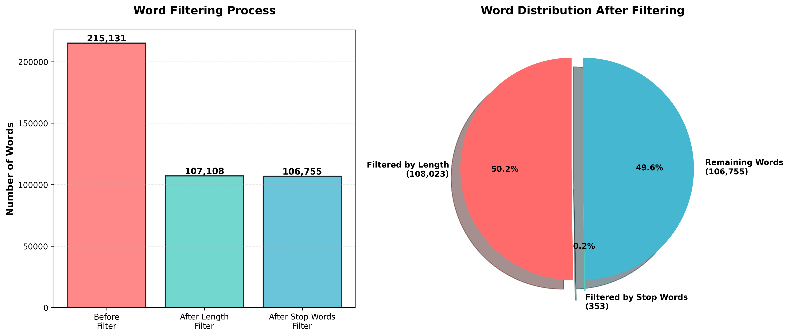
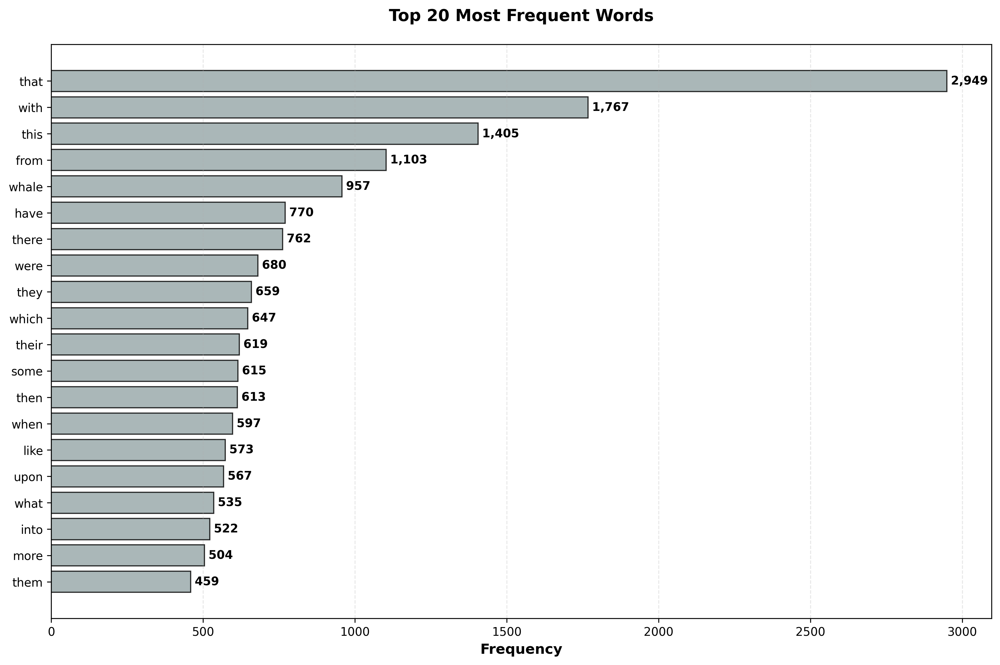

# Text Processing Project

Text processing system implementing multiple algorithms (CPU single-threaded, multi-threaded, GPU, Apache Spark) for word filtering and statistical analysis.

## Processing Pipeline

1. Load text file and stop words
2. Tokenize and normalize words
3. Filter by length (4-8 characters)
4. Filter stop words
5. Compute statistics (frequency, most/least frequent words)

## Results Visualization

### Filtering Process



### Word Frequencies



## Project Structure

```
src/
├── core/              # Data loading, filtering, statistics
├── processors/        # Algorithm implementations
├── utils/             # Utilities
└── visualization/     # Charts
```

## Installation

```bash
pip install -r requirements.txt
```

## Usage

```python
from src.core.data_loader import DataLoader
from src.core.word_filter import WordFilter
from src.core.statistics import StatisticsCalculator

data_loader = DataLoader()
data_lines = data_loader.load_text_file("data.txt")
stop_words = data_loader.load_stop_words("stop_words.txt")
words = data_loader.tokenize_text(data_lines)

word_filter = WordFilter(min_length=4, max_length=8, stop_words=stop_words)
filtered_words = word_filter.apply_all_filters(words)

stats = StatisticsCalculator()
statistics = stats.compute_statistics(filtered_words)
```

## Algorithm Implementations

1. **CPU Single-threaded**: Sequential processing
2. **CPU Multi-threaded**: Parallel processing (all cores)
3. **GPU**: Word-to-ID mapping, GPU filtering
4. **Apache Spark**: Distributed processing

## Requirements

- Python 3.8+
- numpy >= 1.21.0
- matplotlib >= 3.5.0
- Optional: cupy/numba/pycuda (GPU), pyspark (Spark)

## Documentation

- [Word Matching Documentation](docs/WORD_MATCHING_DOCUMENTATION.md)
- [Project Structure Plan](PROJECT_STRUCTURE_PLAN.md)
